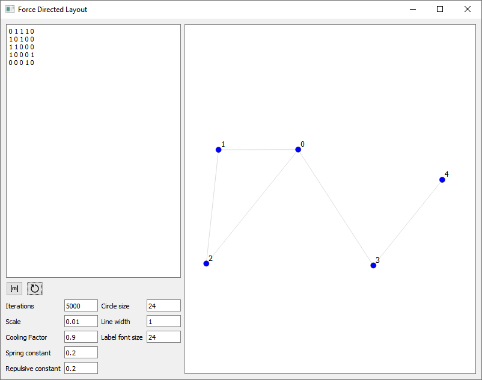
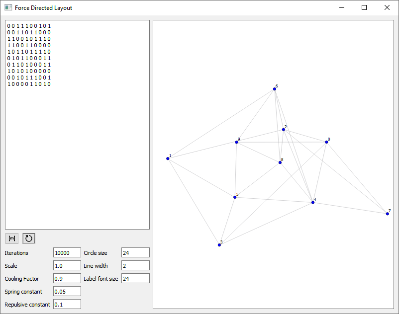
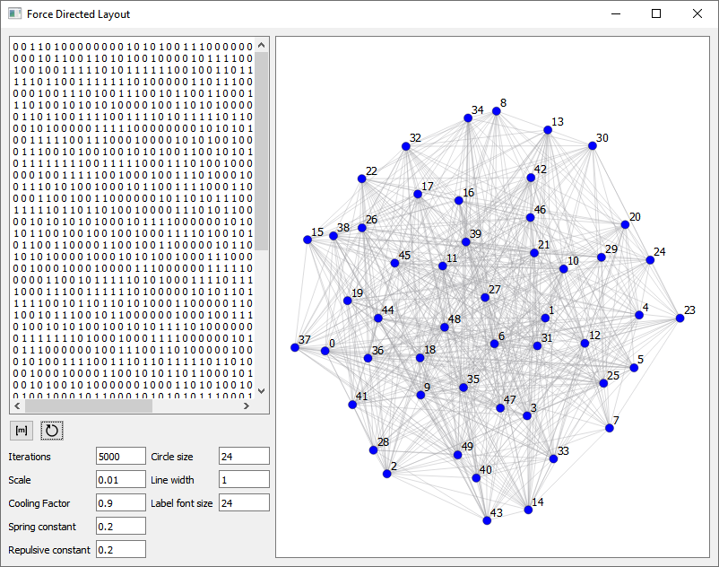

# t1-test

## Force-Directed Graph Layout

This repository contains a implementation of a force-directed graph layout algorithm.

The algorithm aims to organize the graph in a visually appealing manner by simulating attractive forces between connected nodes and repulsive forces between all nodes.

This implementation leverages `Qt/C++` for the graphical aspects and provides a visualization of the force-directed layout for the input graph.

## Build & Run

The implementation is built using `Desktop Qt 5.14.2 with MinGW 32-bit`.

## Demo

Here are some screenshots showcasing the program in action:

